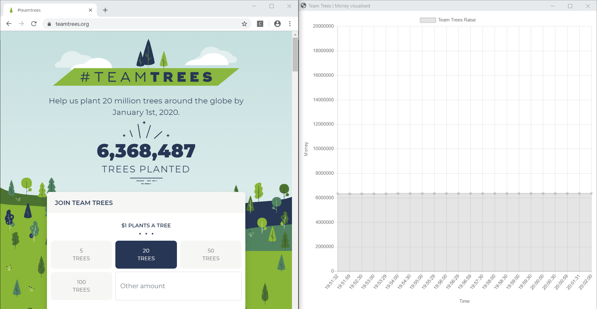

# Team Trees 🌳
A python webscraper that gets the amount of money for [TeamTrees.org](https://teamtrees.org/) every 30 seconds and graphs it realtime. 



## Installation
Install Selenium: 

```bash
pip install selenium
```

Intall eel, a python library for making simple GUI apps.
```bash
pip install eel
```

And download the Chrome webdriver compatible with your version of Chrome [here](https://chromedriver.chromium.org/downloads). Copy the path of the chromedriver.exe and change the value of the chrome_path variable:

```python
chrome_path = r"PATH"
```

## Usage
Open the terminal and run the script

```bash
python scraper.py
```

## Built with

* [TeamTrees](https://teamtrees.org/) - Data source.
* [Eel](https://github.com/samuelhwilliams/Eel?utm_source=mybridge&utm_medium=blog&utm_campaign=read_more) - Python library for making simple Electron-like HTML/JS GUI apps.
* [ChromeDriver](https://chromedriver.chromium.org/downloads) - WebDriver is an open source tool for automated testing of webapps across many browsers.
* [ChartJS](https://www.chartjs.org/) - An easy way to include animated, interactive graphs on your website for free.


## Author

* [Wouter Molhoek](https://github.com/WouterMolhoek/)
